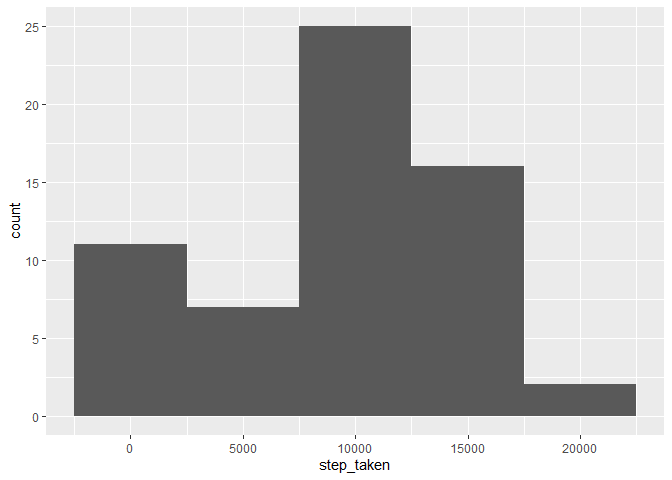
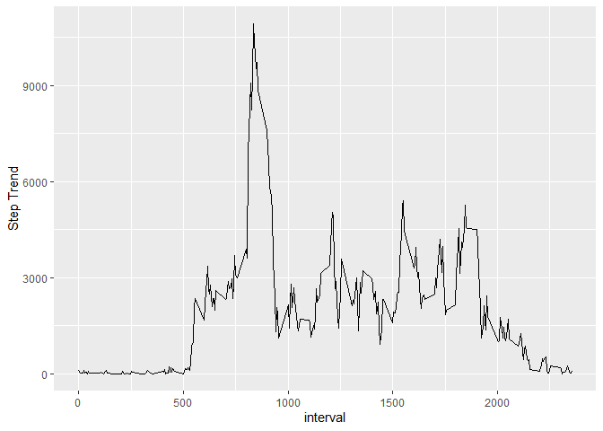
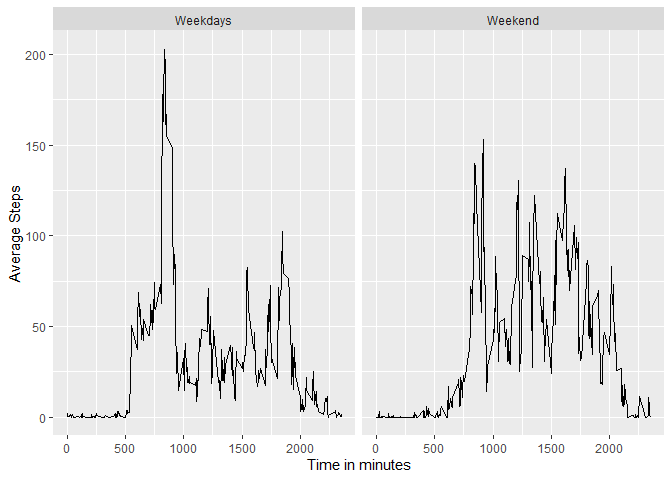

## Loading and preprocessing the data

```r
library(dplyr)
```

```
## 
## Attaching package: 'dplyr'
```

```
## The following objects are masked from 'package:stats':
## 
##     filter, lag
```

```
## The following objects are masked from 'package:base':
## 
##     intersect, setdiff, setequal, union
```

```r
library(lubridate)
```

```
## 
## Attaching package: 'lubridate'
```

```
## The following objects are masked from 'package:base':
## 
##     date, intersect, setdiff, union
```

```r
library(ggplot2)
activity_data <- read.csv("activity.csv")
activity_data$date <- ymd(activity_data$date )

activity_data$weekday <- weekdays(activity_data$date)
```

## Histogram of the total number of steps taken each day


```r
steps_perday <- activity_data %>% group_by(date) %>% 
    summarise(step_taken=sum(steps,na.rm = T))
g <- ggplot(steps_perday) + geom_histogram(aes(x=step_taken), binwidth = 5000)
print(g)
```

<!-- -->


## What is mean total number of steps taken per day?

```r
#Mean
mean_steps <- round(mean(steps_perday$step_taken))
print(mean_steps)
```

```
## [1] 9354
```

```r
#median
median_steps <- round(median(steps_perday$step_taken))
print(median_steps)
```

```
## [1] 10395
```


## What is the average daily activity pattern?
## Time series plot of the average number of steps taken

```r
steps_trend <- activity_data %>% group_by(interval) %>% 
    summarise(tot_step=sum(steps,na.rm = T))

ggplot(steps_trend) + geom_line(aes(x=interval,y=tot_step)) + 
    ylab("Step Trend")
```

<!-- -->


## The 5-minute interval that, on average, contains the maximum number of steps


```r
max_step_row <- which.max(steps_trend$tot_step)

max_interval <- steps_trend$interval[max_step_row]
print(max_interval)
```

```
## [1] 835
```


## Imputing missing values


```r
#median value imputed
activity_data$steps <- ifelse(is.na(activity_data$steps),
                              ave(activity_data$steps, FUN = function(x) median(x, na.rm=T)),
                              activity_data$steps)
```


## Histogram of the total number of steps taken each day after missing values are imputed


```r
steps_perday_after <- activity_data %>% group_by(date) %>% 
    summarise(step_taken=sum(steps,na.rm = T))


g2 <- ggplot(steps_perday_after) + geom_histogram(aes(x=step_taken), binwidth = 5000)
print(g2)
```

<!-- -->


## Are there differences in activity patterns between weekdays and weekends?


```r
activity_data$Weekends <- ifelse(activity_data$weekday %in% c("Saturday","Sunday"),
                                 "Weekend",
                                 "Weekdays")
weeks_trend <- activity_data %>% group_by(interval,Weekends) %>% 
    summarise(ave_step=mean(steps))
```

```
## `summarise()` has grouped output by 'interval'. You can override using the `.groups` argument.
```

```r
ggplot(weeks_trend) + geom_line(aes(x=interval,y=ave_step)) +
    facet_grid(.~Weekends)+
    xlab("Time in minutes")+
    ylab("Average Steps")
```

<!-- -->


